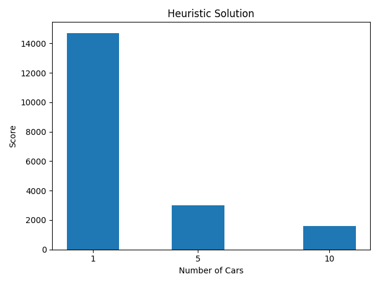

# Logistics Lab Wise25/26
The following can only be executed in Windows.

## Setup

### 1. Open Terminal

Open any Terminal (CMD, Powershell, Alacritty, ...).

### 2. Clone Repository

```bash
git clone https://github.com/anh-lxn/logisticsLab.git
```

### 3. Create Virtual Environment

```bash
cd logisticsLab
python -m venv venv
venv\Scripts\activate
```
### 4. Install Libaries and Packages

```bash
pip install -r requirements.txt
```

## Run the Script

```bash
python src/main.py
```

## Plots



## Authors
- [@anh-lxn](https://www.github.com/anh-lxn)
