# Logistics Lab Wise25/26
Das ist das Repository und die Dokumentation für das Logistics Lab im Wintersemester 2025/26 an der TU Dresden

## Setup

### 1. Open Terminal

Open any Terminal (CMD, Powershell, Alacritty, ...).

### 2. Clone Repository

```bash
git clone https://github.com/anh-lxn/logisticsLab.git
```

### 3. Create Virtual Environment

```bash
cd logisticsLab
python -m venv venv
venv\Scripts\activate

# On Linux or MacOS use:
# source venv/bin/activate
```
### 4. Install Libaries and Packages

```bash
pip install -r requirements.txt
```

### 5. Start the Jupyter Notebook

```bash
jupyter notebook
```


### 6. Open the Notebook
Open the `src/main.ipynb` file in the Jupyter Notebook interface.

---
## 3 Methoden zur Lösung des Problems

### Greedy Heuristic Algorithm
Die Greedy-Heuristik trifft stets die lokal beste Entscheidung. Für die aktuelle Fahrzeugposition wird der näheste Auftrag, also der Transport mit der kürzesten Distanz, ausgewählt.

<u><strong>Beispiel: </strong></u>

Nehmen wir an ein Fahrzeug startet bei Maschine 7.

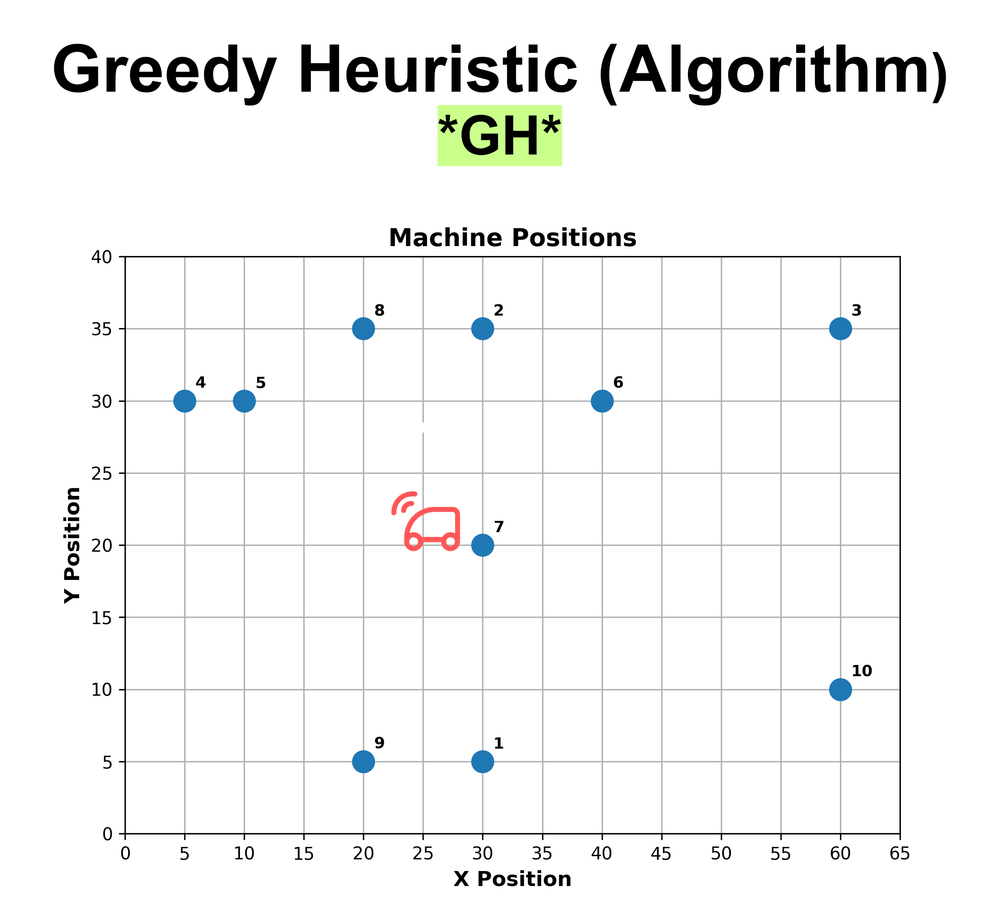

Der nächstgelegene Auftrag mit der geringsten euklidischen Distanz ist der Transport von Maschine 7 zu Maschine 6. Das Fahrzeug fährt also zu Maschine 6 und führt den Auftrag aus.

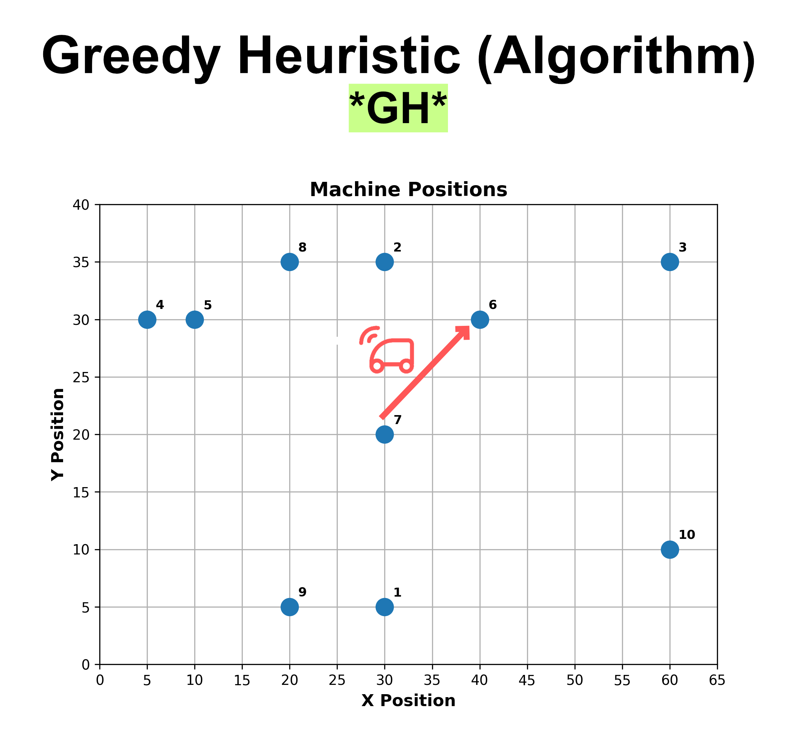

Angekommen bei Maschine 6, wird erneut der nächstgelegene Auftrag ausgewählt. In diesem Fall ist es der Transport von Maschine 6 zu Maschine 2. Das Fahrzeug fährt zu Maschine 2 und führt den Auftrag aus.

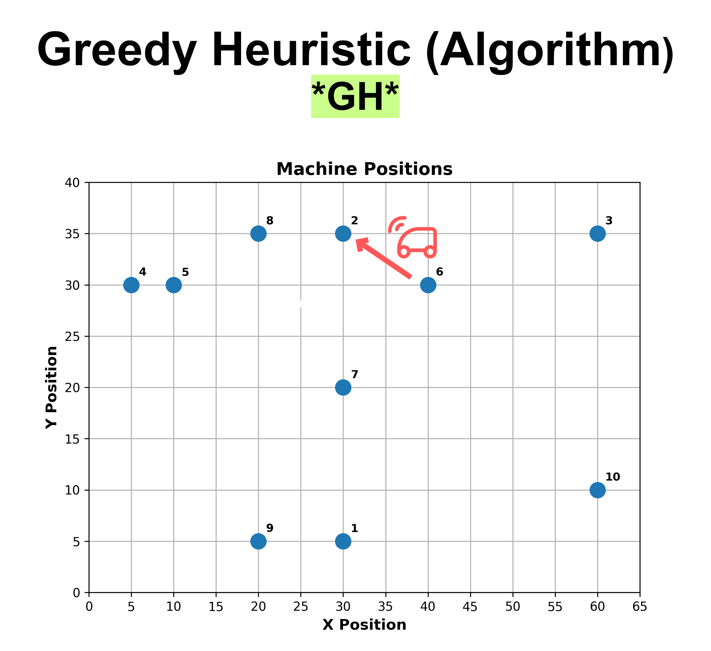

Dieser Prozess wird fortgesetzt, bis alle Aufträge ausgeführt wurden.

---

### Randomized Greedy Heuristic
Die Randomized Greedy Heuristic ähnelt der Greedy Heuristic, jedoch wird eine Zufallskomponente eingeführt. Anstatt immer den nächstgelegenen Auftrag auszuwählen, wird aus den k nächstgelegenen Aufträgen zufällig einer ausgewählt. Dies ermöglicht eine größere Vielfalt an Lösungen und kann helfen, lokale Optima zu vermeiden.

<u><strong>Beispiel: </strong></u>

Nehmen wir an, ein Fahrzeug startet bei Maschine 7.

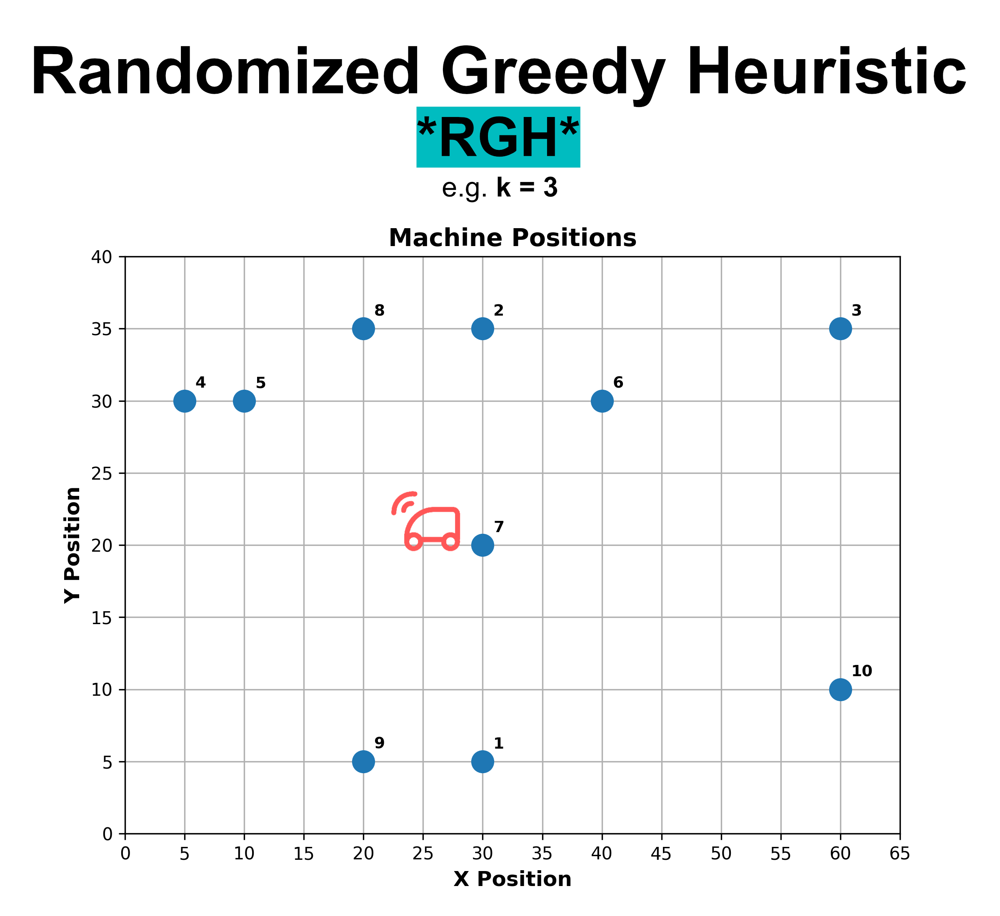

Wir haben ein k von 3 gewählt, was bedeutet, dass das Fahrzeug aus den 3 nächstgelegenen Aufträgen zufällig einen auswählt. In diesem Fall sind die 3 nächstgelegenen Aufträge:

1. Transport von Maschine 7 zu Maschine 2
2. Transport von Maschine 7 zu Maschine 6
3. Transport von Maschine 7 zu Maschine 1

Es wählt mit einem festen random seed z.B. den Auftrag von Maschine 7 zu Maschine 1 aus. Das Fahrzeug fährt also zu Maschine 1 und führt den Auftrag aus.

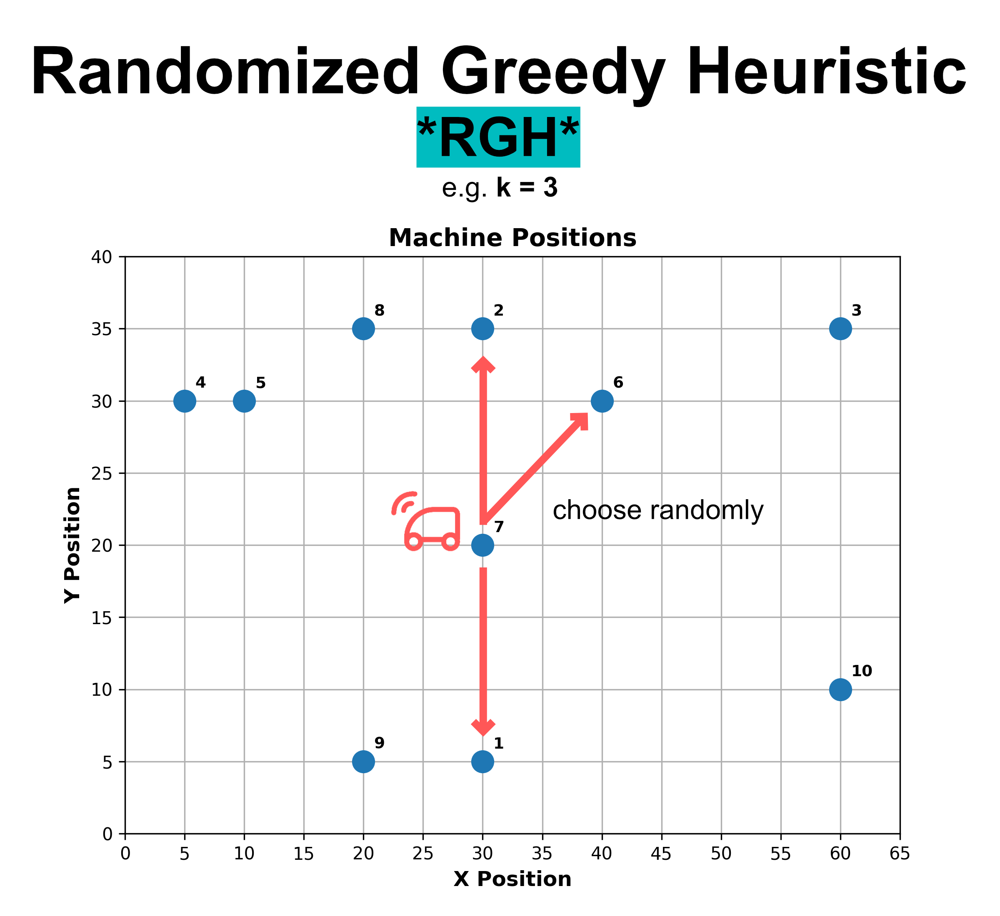

Angekommen bei Maschine 1, werden erneut die 3 nächstgelegenen Aufträge betrachtet:
1. Transport von Maschine 1 zu Maschine 9
2. Transport von Maschine 1 zu Maschine 7
3. Transport von Maschine 1 zu Maschine 10

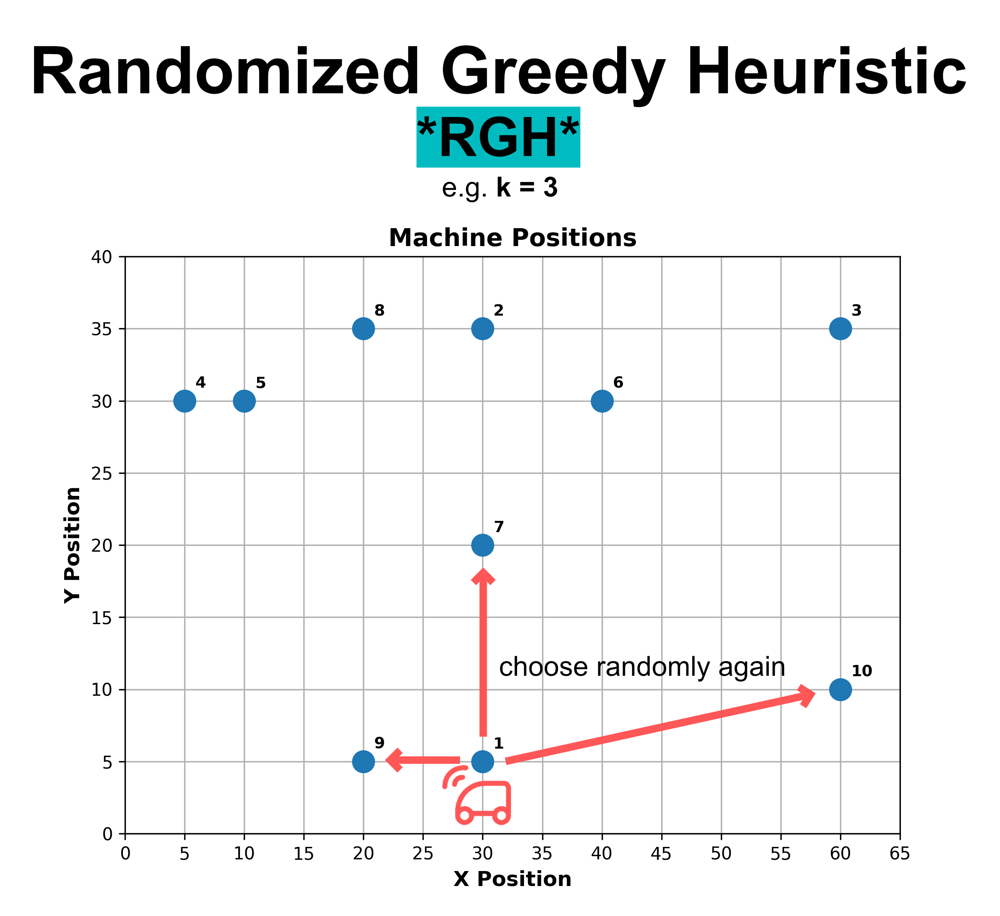

Dieser Prozess wird fortgesetzt, bis alle Aufträge ausgeführt wurden.

---

### Multistart Randomized Greedy Heuristic
Die Multistart Randomized Greedy Heuristic erweitert die Randomized Greedy Heuristic, indem sie den Algorithmus mehrfach mit unterschiedlichen random seeds ausführt. Dadurch wird eine größere Vielfalt an Lösungen generiert, und es besteht eine höhere Wahrscheinlichkeit, eine bessere Gesamtlösung zu finden.

<u><strong>Beispiel: </strong></u>

Nehmen wir an, ein Fahrzeug startet bei Maschine 7.

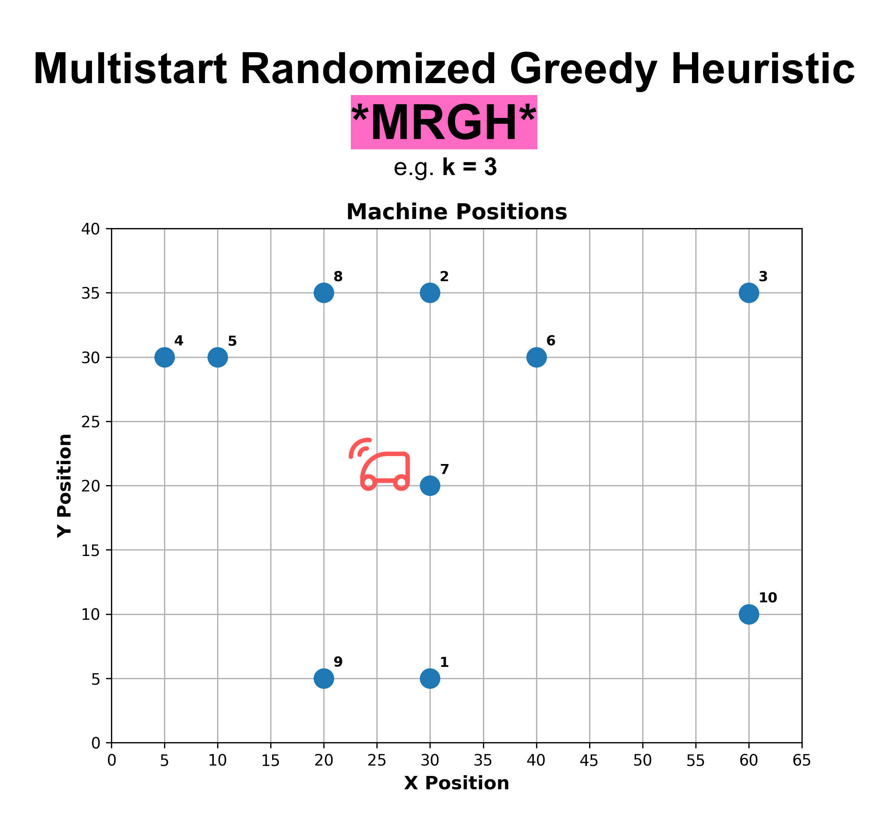

Mit k = 3 nimmt das Fahrzeug die 3 nächstgelegenen Aufträge wieder in Betracht.

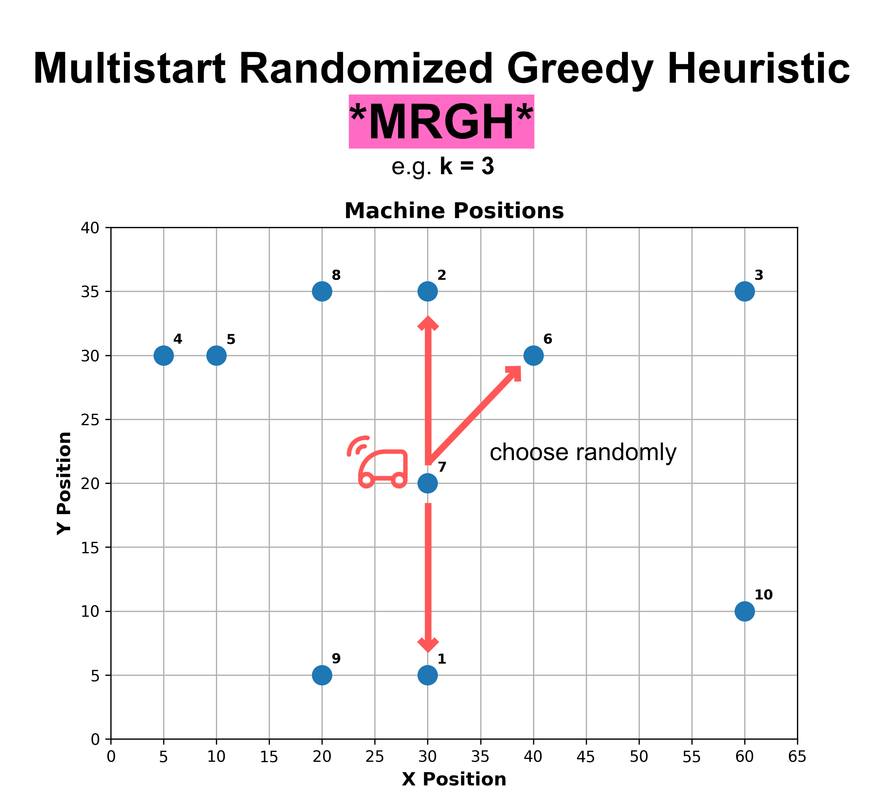

In der ersten Iteration mit dem random seed = 1, wählt es z.B. den Auftrag von Maschine 7 zu Maschine 6 aus. Das Fahrzeug fährt also zu Maschine 6 und führt den Auftrag aus.
In der zweiten Iteration mit dem random seed = 2, wählt es z.B. den Auftrag von Maschine 7 zu Maschine 1 aus. Das Fahrzeug fährt also zu Maschine 1 und führt den Auftrag aus.

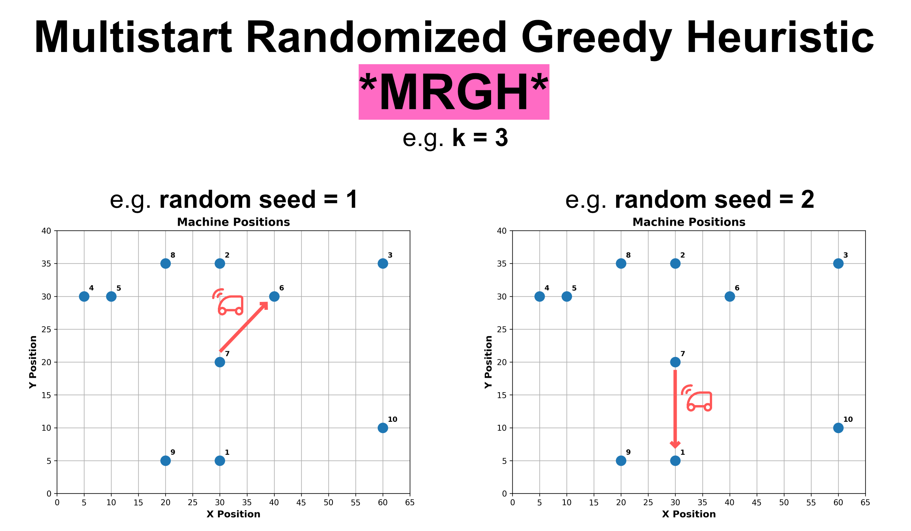

Dies wird fortgesetzt, bis alle Aufträge ausgeführt wurden.

## Results

Im Folgenden sind die Validierungsergebnisse der drei implementierten Algorithmen dargestellt
Auf der x-Achse sind die 3 Methoden abgebildet mit dem jewiligen k-Wert für die Randomized Greedy Heuristic und Multistart Randomized Greedy Heuristic:

1. Greedy Heuristic (GH)
2. Randomized Greedy Heuristic (RGH)
3. Multistart Randomized Greedy Heuristic (MRGH) 

Auf der y-Achse ist auf der linken Seite der <span style="color:skyblue">Validationsscore</span> (niedriger ist besser) und auf der rechten Seite die Anzahl der <span style="color:red">Leerfahrten</span> (niedriger ist besser) dargestellt.
Des Weiteren gibt es 3 Diagramme für die Validierung mit 1, 5 und 10 Fahrzeugen.

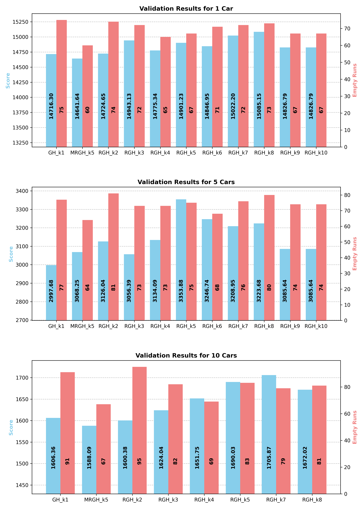

---

Im Folgenden sind die besten Valiedierungsergebnisse für jedes Szenario dargestellt. Also die Szenarien mit 1, 5 und 10 Fahrzeugen.

Auf der x-Achse kann man die beste Methode für das jeweilige Szenario ablesen.

Herausgestellt hat sich, dass für 1 Fahrzeug und für 10 Fahrzeuge die Multistart Randomized Greedy Heuristic (MRGH) die Validationsscores liefert.
Für 5 Fahrzeuge hingegen liefert die Greedy Heuristic (GH) die Validationsscores.

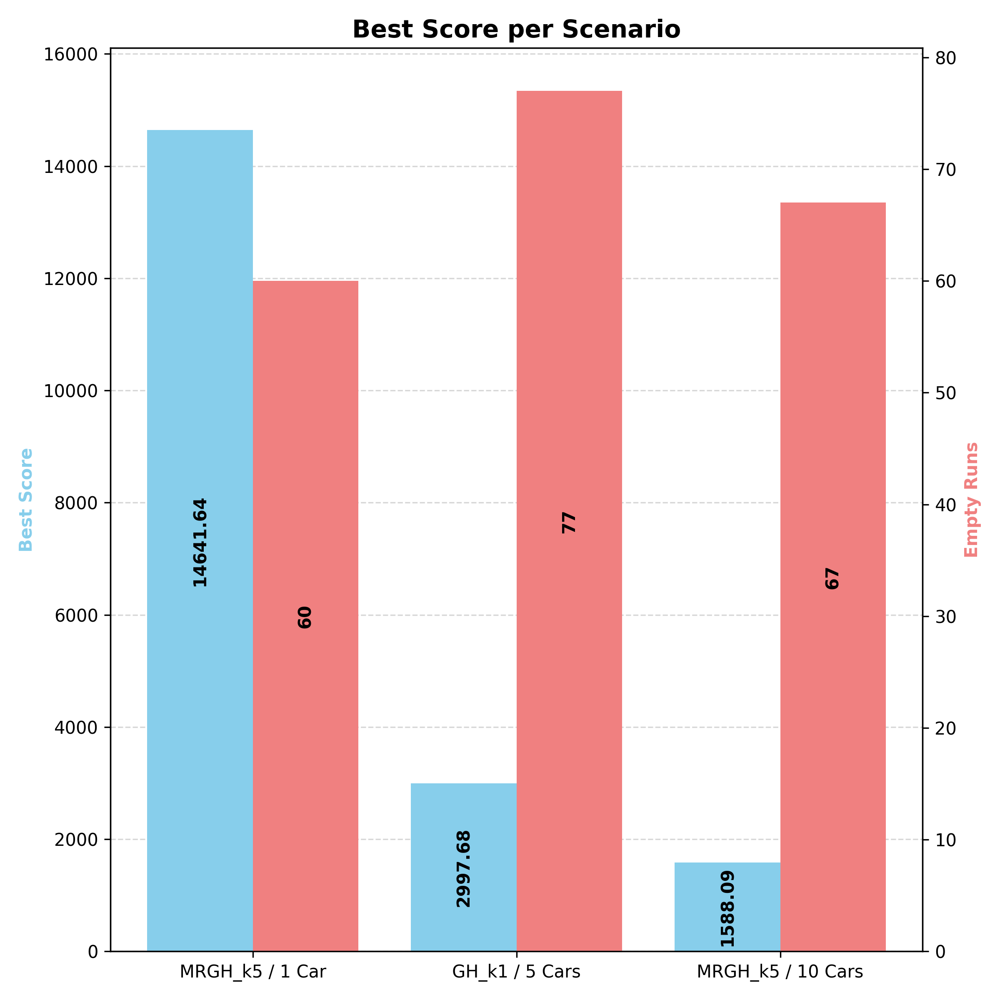

## Citation

> **Harahap, R. F., & Sawaluddin**,
> *"Study vehicle routing problem using Nearest Neighbor Algorithm"*,
> Journal of Physics: Conference Series, doi: 10.1088/1742-6596/2421/1/012027, 2023,
> [[Paper]](https://www.researchgate.net/publication/367415289_Study_vehicle_routing_problem_using_Nearest_Neighbor_Algorithm).

> **Lague, S. (2021):**,
> *"Coding Adventure: Ant and Slime Simulations"*,
> [[Github]](https://github.com/SebLague/Ant-Simulation),
> [[Youtube]](https://www.youtube.com/@SebastianLague).

> **Weiner, A. (2021)**,
> *ML-CFD Lecture – Surrogate Modeling for Discrete and Continuous Predictions (Lectures 4&5)*,
> [[Github]](https://github.com/AndreWeiner/ml-cfd-lecture).


## Authors
- [@Anh Le Xuan](https://anhlexuan.com)
- [@Herik Max Stein]
- [@Max Berthold]
- [@Moritz Engelmann]